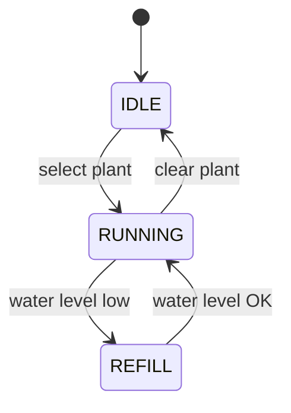

# Hydroponic Grow Controller

CpE 190 Senior Design — an STM32-based controller for a closed hydroponic grow enclosure. The firmware selects a plant profile, then automatically regulates **lights**, **air & water temperature**, **water level**, **pH**, and **nutrient EC** through a closed-loop state machine.

**Target board:** [NUCLEO-H753ZI](https://www.st.com/en/evaluation-tools/nucleo-h753zi.html) (STM32H753ZI)

---

## What it does

1. **Pick a plant** on the touchscreen (or via debug console).
2. **`growControl`** runs every main-loop iteration with the latest sensor sample.
3. Actuators respond to targets from the active plant profile and growth stage:
   - Spectrum lights (white / blue / red / NIR) on a photoperiod
   - Enclosure fans when air is warm or hot
   - Reservoir cooler when water is above target
   - pH up/down dosing when out of band
   - Flora Micro → Grow → Bloom nutrient dosing when EC is low
4. If the reservoir water level drops too low, the system enters **REFILL** and pauses new chemistry doses until the tank is restored.

Detailed FSM diagrams and thresholds live in [`docs/growControl-state-machine.md`](docs/growControl-state-machine.md).



| State | Behavior |
|-------|----------|
| **IDLE** | No plant selected; actuators safe/off |
| **RUNNING** | Full closed-loop: lights, climate, chemistry |
| **REFILL** | Water low — climate/lights continue; new nutrient doses blocked |

---

## Hardware overview

| Subsystem | Hardware | Notes |
|-----------|----------|--------|
| MCU | STM32H753ZI (NUCLEO-144) | CubeMX project: `Senior_Design.ioc` |
| Display | ILI9341 LCD + touch | LVGL UI |
| Time | DS3231 RTC (I²C) | Photoperiod from wall clock |
| Air / water temp | DS18B20 ×2 | Enclosure + reservoir |
| Water level | Analog sensor (ADC3) | REFILL gate at raw ADC 3000 |
| pH / EC | Analog pH + TDS probes | Chemistry loop every 5 s |
| Lights | PWM white / blue / red / NIR | TIM1 / TIM3 / TIM4 |
| Fans | PWM fans | TIM1 CH4, TIM3 CH1 |
| Cooler | GPIO | Reservoir cooling |
| Dosing pumps | Peristaltic (GPIO) | pH up/down + Flora Micro/Grow/Bloom |

Pin map and CubeMX config: `Senior_Design.ioc`, `Core/Inc/main.h`.

---

## Plant profiles

Each plant has enclosure/water temperature targets, photoperiod length, white-light level, and per-stage Blue/Red/NIR PWM percentages:

- Early Growth → Late Growth → Early Bloom → Mid-Late Bloom

Supported profiles include Arugula, Lettuce, Basil, Spinach, Kale, Bok Choy, Swiss Chard, Cilantro, Parsley, Mint, Green Onion, Romaine, Butterhead, and Mustard Greens (`Core/Src/plantProfiles.c`).

Nutrient volumes and pH/EC bands come from `lightFeedProfile` per growth stage (`Core/Src/FeedProfile.c`).

---

## Software layout

```
Core/
  Inc/  Src/          Application firmware
Drivers/
  STM32H7xx_HAL_…     ST HAL
  lvgl/               UI framework
  BSP/                Nucleo board support
docs/
  growControl-state-machine.md
Senior_Design.ioc     CubeMX pin/peripheral config
Makefile              Make build (TARGET = Senior_Design)
```

| Module | Role |
|--------|------|
| `growControl` | Top-level closed-loop FSM |
| `lights` | Photoperiod + stage PWM |
| `fans` / `climateControl` | Enclosure fans + cooler |
| `PHDose` / `NutrientDose` / `Doser` | Chemistry dosing |
| `PeristalticPump` | Timed pump run (non-inverted: high = on) |
| `plantProfiles` / `FeedProfile` | Targets and feed recipes |
| `GUI` / LVGL screens | Home, plant select, settings |
| Sensor drivers | DS18B20, pH, TDS, water level, DS3231 |

---

## Build & flash

Requires an ARM GCC toolchain (`arm-none-eabi-gcc`) and a Nucleo programmer (OpenOCD / ST-LINK).

```bash
make            # builds build/Senior_Design.elf / .bin / .hex
make clean
```

Flash with your usual ST-LINK flow (CubeProgrammer, OpenOCD, or your IDE’s flash target).

CubeMX regenerates from `Senior_Design.ioc` — keep application logic in `USER CODE` sections and under `Core/Src` modules that are not overwritten.

---

## Runtime modes

In `main.c`:

- **Screen mode** (`USING_SCREEN`) — LVGL touch UI; `growControl_update()` runs from the main loop with live sensors.
- **Debug console** (`USING_DEBUG`) — serial menu over ST-LINK VCP (115200 8N1) for manual fan/pump/light/dose demos.

---

## Control timing (defaults)

| `#define` | Value | Purpose |
|-----------|-------|---------|
| `GROW_LIGHT_PERIOD_MS` | 1000 | Photoperiod / light PWM |
| `GROW_CLIMATE_PERIOD_MS` | 1000 | Fans + cooler |
| `GROW_CHEM_PERIOD_MS` | 5000 | pH / EC decisions |
| `GROW_ENCL_HYST_C` | 1.5°C | Enclosure fan bands |
| `GROW_WATER_HYST_C` | 1.0°C | Cooler on threshold |
| `GROW_WATER_LOW_RAW` | 3000 | REFILL gate |
| `GROW_TANK_GALLONS` | 3.0 | Nutrient dose scaling |

---

## Documentation

- [GrowControl state machine](docs/growControl-state-machine.md) — traditional FSMs for top-level, climate, lights, and chemistry
