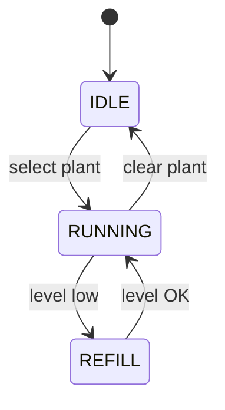
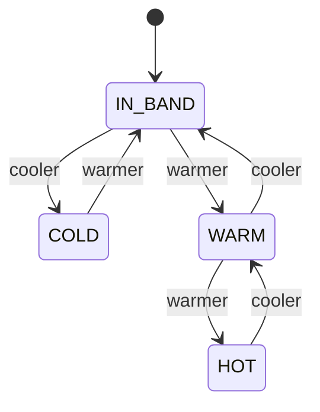
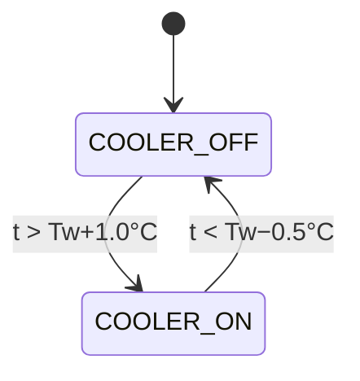
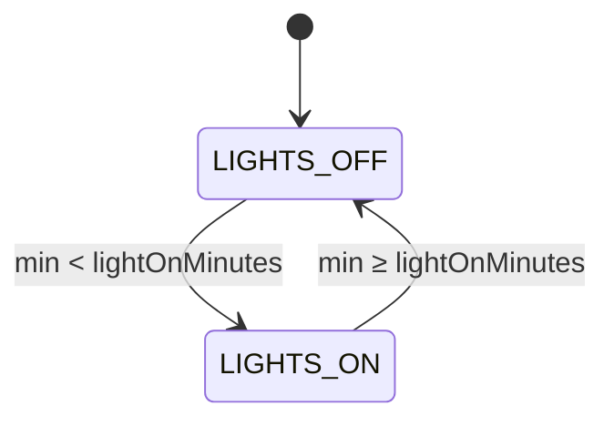
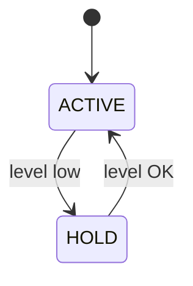
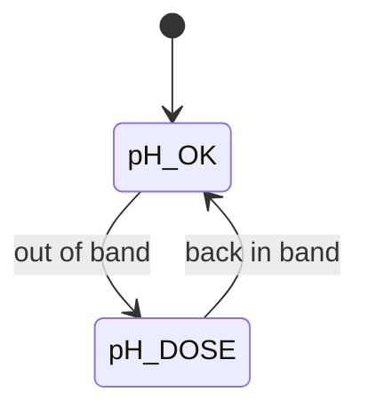
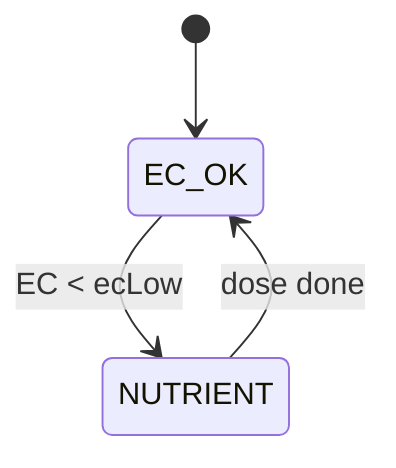
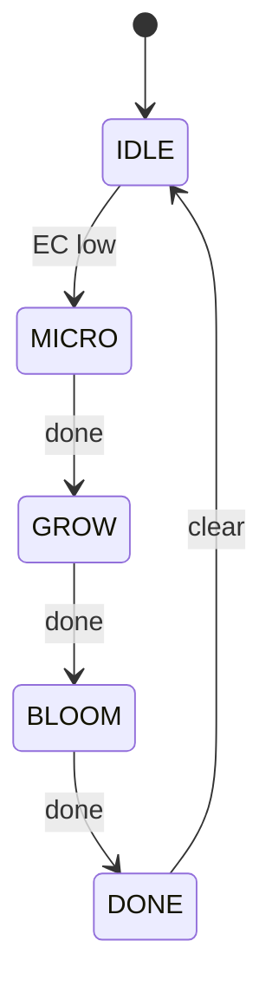

# GrowControl — detailed traditional FSM

Source of truth: `Core/Src/growControl.c` (and nested dosers in `PHDose.c` / `NutrientDose.c`).

Te = enclosure target (`plantProfile.enclosureTemp`).  
Tw = water target (`plantProfile.waterTemp`).

| Constant | Value |
|----------|-------|
| Enclosure hysteresis | ±1.5°C |
| HOT fan threshold | Te + 3.0°C (2× hysteresis) |
| Water cooler on / off | Tw + 1.0°C / Tw − 0.5°C |
| Water-level REFILL gate | ADC raw 3000 |

---

## 1. Top-level grow FSM



| Tag | From → To | Event / action |
|-----|-----------|----------------|
| select plant | IDLE → RUNNING | `setPlant(profile)` / apply stage lights |
| clear plant | RUNNING → IDLE | `setPlant(NULL)` / `safeActuators()` |
| level low | RUNNING → REFILL | `waterLevelRaw < 3000` / pause nutrient request |
| level OK | REFILL → RUNNING | `waterLevelRaw ≥ 3000` / resume chemistry |

| State | Periodics | Notes |
|-------|-----------|-------|
| IDLE | none | Lights/fans/cooler off |
| RUNNING | lights 1s · climate 1s · chem 5s | Full closed-loop |
| REFILL | lights + climate; doser poll only | No new nutrient doses |

---

## 2. Enclosure air temperature FSM

Te = `plantProfile.enclosureTemp`. `GROW_ENCL_HYST_C = 1.5°C`. Period 1000 ms.



| State | Condition | Fan0 | Fan1 |
|-------|-----------|------|------|
| HOT | t > Te + 3.0°C | HIGH | MED |
| WARM | t > Te + 1.5°C | MED | LOW |
| IN BAND | Te−1.5 ≤ t ≤ Te+1.5 | LOW | OFF |
| COLD | t < Te − 1.5°C | OFF | OFF |

**Example: Lettuce Te = 21.0°C** — COLD if t < 19.5°C · IN BAND 19.5–22.5°C · WARM if t > 22.5°C · HOT if t > 24.0°C

| Plant | Te (°C) | COLD < | IN BAND | WARM > | HOT > |
|-------|---------|--------|---------|--------|-------|
| Arugula | 22.0 | 20.5 | 20.5–23.5 | 23.5 | 25.0 |
| Lettuce | 21.0 | 19.5 | 19.5–22.5 | 22.5 | 24.0 |
| Basil | 24.0 | 22.5 | 22.5–25.5 | 25.5 | 27.0 |
| Spinach | 19.0 | 17.5 | 17.5–20.5 | 20.5 | 22.0 |
| Kale | 20.0 | 18.5 | 18.5–21.5 | 21.5 | 23.0 |

---

## 3. Reservoir water temperature FSM

Tw = `plantProfile.waterTemp`. `GROW_WATER_HYST_C = 1.0°C`. Off threshold uses half hyst (Tw − 0.5°C).



| Tag | Transition | Action |
|-----|------------|--------|
| t > Tw+1.0°C | OFF → ON | `turnOnCooler()` |
| t < Tw−0.5°C | ON → OFF | `turnOffCooler()` |

| Plant | Tw (°C) | Cooler ON > | Cooler OFF < |
|-------|---------|-------------|--------------|
| Arugula | 20.0 | 21.0 | 19.5 |
| Lettuce | 19.0 | 20.0 | 18.5 |
| Basil | 22.0 | 23.0 | 21.5 |
| Spinach | 18.0 | 19.0 | 17.5 |
| Kale | 19.0 | 20.0 | 18.5 |

---

## 4. Water level gate

| ADC raw | State | Chemistry | Climate / lights |
|---------|-------|-----------|------------------|
| ≥ 3000 | RUNNING | pH + EC dosing allowed | Active |
| < 3000 | REFILL | New nutrient doses blocked | Still active |

---

## 5. Photoperiod / lights FSM

`minutesOfDay = hour×60 + minute`. Period 1000 ms.



| Tag | Action |
|-----|--------|
| min < lightOnMinutes | Set White/Blue/Red/NIR from active growth stage |
| min ≥ lightOnMinutes | `Lights_Off()` |

---

## 6. Chemistry supervision FSMs

Period 5000 ms. Targets from `lightFeedProfile[activeStage]`. Tank = 3.0 gal.

While **ACTIVE**, both pH and EC loops may run. **HOLD** freezes new dose decisions; in-progress dosers still poll via `PHDoseUpdate` / `nutrientDoseUpdate`.

### 6a. REFILL gate



| Tag | Meaning |
|-----|---------|
| level low | Top-level REFILL — no new pH/nutrient decisions |
| level OK | Water restored — dosing allowed again |

### 6b. pH loop



| Tag | Meaning |
|-----|---------|
| out of band | pH < targetPH−phRange OR pH > targetPH+phRange → `PHDose()` |
| back in band | pH inside [phLow, phHigh] → idle |

### 6c. EC / nutrient loop



| Tag | Meaning |
|-----|---------|
| EC < ecLow | EC < targetEC−ECRange and nutrient IDLE → start dose |
| dose done | NutrientDose reaches `STATE_DONE` → clear request |

### Stage feed targets (`lightFeedProfile`)

| Stage | Micro | Grow | Bloom | targetEC | ecLow | targetPH | pH band |
|-------|-------|------|-------|----------|-------|----------|---------|
| Early Growth | 3.6 | 3.4 | 2.6 | 1.0 | 0.9 | 6.0 | 5.5–6.5 |
| Late Growth | 6.0 | 5.6 | 4.2 | 1.5 | 1.4 | 6.0 | 5.5–6.5 |
| Early Bloom | 5.3 | 4.7 | 6.1 | 1.5 | 1.4 | 6.0 | 5.5–6.5 |
| Mid-Late Bloom | 4.7 | 4.7 | 6.6 | 1.5 | 1.4 | 6.0 | 5.5–6.5 |

```c
phLow  = targetPH - phRange;
phHigh = targetPH + phRange;
ecLow  = targetEC - ECRange;
if (pH < phLow || pH > phHigh) PHDose(ph);
if (EC < ecLow && nutrient IDLE) nutrientDose_loadFeed(feed, 3.0);
```

### NutrientDose nested sequential FSM



| State | Action |
|-------|--------|
| IDLE | Start Micro when EC-low request is set |
| MICRO | FloraMicro dose → then GROW |
| GROW | FloraGrow dose → then BLOOM |
| BLOOM | FloraBloom dose → DONE + TDS read |
| DONE | Cleared back to IDLE by growControl |

---

## 7. Timing summary

| `#define` | Value | Used for |
|-----------|-------|----------|
| `GROW_ENCL_HYST_C` | 1.5°C | Enclosure fan bands |
| `GROW_WATER_HYST_C` | 1.0°C | Reservoir cooler on threshold |
| `GROW_WATER_LOW_RAW` | 3000 | REFILL water-level gate |
| `GROW_LIGHT_PERIOD_MS` | 1000 | Photoperiod update |
| `GROW_CLIMATE_PERIOD_MS` | 1000 | Temp regulation |
| `GROW_CHEM_PERIOD_MS` | 5000 | pH/EC decisions |
| `GROW_TANK_GALLONS` | 3.0 | Nutrient dose volume scale |
